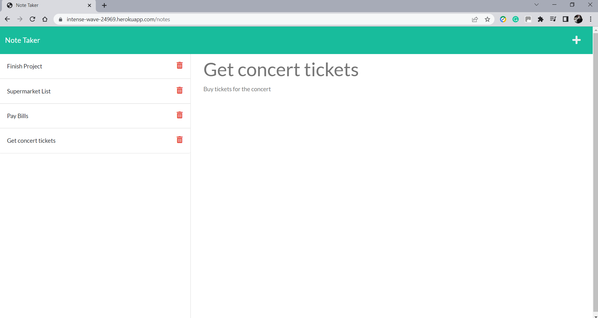

# Note Taker

## Table of Contents
- [Project Description](#Project-Description)

- [Application Screenshot](#Application-Screenshot)

- [Installation](#Installation)

- [Usage](#Usage)

- [Test Instructions](#Test-Instructions)

- [Questions](#Questions)

- [Links](#Links)

## Project Description
This project is an application called Note Taker that can be used to write and save notes online. The application uses Express.js as the framework for the application back end to direct the routes to save and retrieve notes data from a JSON file.
###### [Back to Index](#Table-of-Contents)


## Application Screenshot


## Installation
To run the project, the user must install Node.js, and Express.js for the routes, uniqid to generate an ID for each note, and Insomnia to perform GET, POST and DELETE tests. Download Node.js from the [Node.js website](https://nodejs.org/en/), and [Insomnia](https://insomnia.rest/download). Follow the instructions from the [Express.js Installing website](https://expressjs.com/en/starter/installing.html) and [uniqid npm website](https://www.npmjs.com/package/uniqid) on how to install them. Finally, create an account in [Heroku](https://www.heroku.com/) to host the application.
###### [Back to Index](#Table-of-Contents)


## Usage
To run the Note Taker, all the programs previously described have to be installed in the directory of the project. Clone this repository and in the terminal, from the root of the project run:

```
$ npm init
$ npm i express
$ npm install uniqid
$ npm start
```
By doing this, the user's computer will become a local server that will allow running the application. Once this is done, open the browser and go to http://localhost:3010/notes to run the Note Taker.
###### [Back to Index](#Table-of-Contents)


## Test Instructions
Install the dependencies on your computer as previously described. Execute from the terminal the tests for the data files using Jest by typing:

Open and run insomnia. Add GET, POST and DELETE HTTP requests using the URL http://localhost:3010. In the browser, you can also verify the web page is loading using the same URL http://localhost:3010/ and also add and delete notes.
###### [Back to Index](#Table-of-Contents)
	

## Questions
Please, feel free to get in touch with me at jaimes.ac.5@gmail.com to discuss any inquiries or suggestions for the project. I will be happy to connect with you!
###### [Back to Index](#Table-of-Contents)
	

## Links
- [Application Repository](https://github.com/AlexJCturbo/note-taker)
- [Heroku Hosting Page](https://intense-wave-24969.herokuapp.com/)
- [GitHub Profile](https://github.com/AlexJCturbo)
###### [Back to Index](#Table-of-Contents)